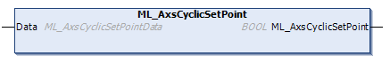
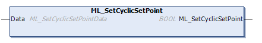

<h1 align="center">
  <br>
  
  <br>
  HEI-Vs Engineering School - Industrial Automation Base
  <br>
</h1>

Cours AutB

# AutB-PracticalWork-CyclicSetPoint

Author: [Cédric Lenoir](mailto:cedric.lenoir@hevs.ch)

*Keywords:* **Polynomial Cyclic Set Point**

# Objectif
## Objectif initial
Dans un premier temps, l'idée de ce module était d'utiliser un **FB_CamIn**. Le **FB_CamIn** permet de synchroniser un axe réel sur un axe virtual en utilisant un profil de mouvement, **typiquement un polynôme d'ordre 5**.
Ce genre de fonctionnement était nécessaire dans les PLC d'ancienne génération qui ne possédaient pas la puissance de calcul nécessaire pour *calculer à la volée*, les points d'un profil.

Les profils étaient chargés à l'avance dans le système d'entrainement électrique et le PLC se contentaient de lancer des commandes de démarrage des profils.

## Plan B
Le **FB_CamIn** n'étant pas disponible, l'idée a été de se tourner vers un bloc spécifique de la librairie Bosch Rexroth, **MB_CyclicSetPoint**. Les Function Blocks de la librairie **PLCopen** de Bosch Rexroth avec l'entête **MB** sont des Function Blocks qui suivent le principe de fontionnement de PLCopen, *Execute, AXIS_REF, Active, Error...* mais implémentent une fonction particulière.

## Plan C
**MB_CyclicSetPoint** est documenté, mais pas implémenté dans la librairie CXA_PLCopen au moment de l'écriture de ce cours, 17 octobre 2023. On se tourne vers sa version **AxsCyclicSetPoint**, **SetCyclicSetPoint**. Le comportement est identique à MB_CyclicSetPoint, mais l'implémentation est légèrement différente.

<figure>
    
    <figcaption>ML_AxsCyclicSetPoint, source: Bosch Rexroth</figcaption>
</figure>

<figure>
    
    <figcaption>ML_SetCyclicSetPoint, source: Bosch Rexroth</figcaption>
</figure>

> Here, we must see these two functions as two function blocks which **do not have their own static internal variables**.
Static variables are provided by the structures passed by Data ``VAR_IN_OUT``.

## AxsCyclicSetPoint, SetCyclicSetPoint - Cyclic command value
*From Bosch Rexroth documentation*
### General information
The user can implement **individual Motion profiles** and cyclically send the command value to the drive with this function.

### The function consists of two parts:
- **AxsCyclicSetPoint** is an unbuffered Motion command that cyclically sends
the external command value of an axis directly to the drive.

- **SetCyclicSetPoint** is a Motion system interface which is used to update the
external command axis value in a real-time bundle or in a PLC task whose
cycle time is equal to the Motion kernel.
First, enable the function with the ``AxsCyclicSetPoint`` command The axis has
to be in the ``STANDSTILL`` state. Subsequently, the command value can be
updated with the ``SetCyclicSetPoint`` command.

### After the AxsCyclicSetPoint command is active:

- The axis remains on the current position until the external command value is
changed
- The axis is always in the **DISCRETE_MOTION** state, also if the axis velocity is
zero
- The AxsCyclicSetPoint command can only be stopped by the axsAbort command
- The axis runs into the error state and stops the motion if its dynamic
limits, *position, velocity, acceleration, deceleration* exceed the configuration
values
- The **AxsInterrupt** and **AxsContinue** commands do not work in this case
- The command cannot be influenced by **Override**.

# Base de travail
Ce TP reprend en partie le TP précédent PracticalWork-MoveAbsolute, mais l'encapsule Idle jusqu'à la fin du mouvement initial dans un seul Functional Block.

> **Développer le comportement d'une partie de code dans un programme**, **PRG**, facilite en général le développement, même si la finalité reste de l'encapsuler dans un Bloque Fonctionnel.

# Le job

A voir à la fin, mais probablement que **taper l'algorithme** et le tester sera déjà un bon job.

Ensuite, on peut demander de tester des options

# Calcul des points

```
    // Ce machin là va devoir être expliqué avec pas mal de détail en théorie.
    lrTimeScaler   
```
## Etape 1 Code Fwd
Il y a concrètement deux approches.

### Calcuer les points à la vitesse du bus real-time.
Ceci est facile à réaliser si l'on travaille avec des profils simples du type polynôme d'ordre 5.
C'est aussi la manière la plus simple de programmer.

### Calculer à l'avance une trajectoire complexe.
Cela permettrait par exemple d'optimier une trajectoire avec des contraintes complexe et da la mémoriser dans un tableau indexé.

## Etape 2 Test avec SetPoint et visu.

## Etape 3 Link with SetCyclic.

## Etape 4 Mouvement en continu.

## Voir Matlab, voir Biagiotti 5.2 Scaling in Time voir code
C'est simple à faire, cela peut être plus simple à concevoir.

# Test avec un Matlab mlx généré en HTML

A revoir...

## Une fois le code en IF..ELSE

```iecst
udiMotionTime_ms := udiCyclTime_ms * udiCycleTimeMult;

IF udiCycleTimeMult > GVL_CyclSetPoint.c_uiMaxProfilePoints THEN
    bErrorTimeMultToBig := TRUE;
    bActive := FALSE;
    bDoneForward := FALSE;
    bDoneBackward := FALSE;
ELSIF bStartForward THEN
    rStartForward(clk := bStartForward);
    // Init motion
    IF rStartForward.Q THEN
        discreteTimeIndex := 0; 
        lrTimeScaler := 1/UDINT_TO_LREAL(udiCycleTimeMult);
        bActive := TRUE;
        bDoneForward := FALSE;
    END_IF
    
    IF bStartForward    AND 
       NOT bDoneForward THEN
        // Matlab operation with some modifications : 
        // position_yAxis(iLoop) = (t_xAxis(iLoop)^3 * P5_position(4) + t_xAxis(iLoop)^4 * P5_position(5) + t_xAxis(iLoop)^5 * P5_position(6)) * y_scaling_mm;
        arGoToPos[discreteTimeIndex] := (EXPT(lrTimeScaler*discreteTimeIndex,3) * GVL_CyclSetPoint.P5[4] +
                                         EXPT(lrTimeScaler*discreteTimeIndex,4) * GVL_CyclSetPoint.P5[5] +
                                         EXPT(lrTimeScaler*discreteTimeIndex,5) * GVL_CyclSetPoint.P5[6]) * endPosition_mm;
        // inc at each cycle
        discreteTimeIndex := discreteTimeIndex + 1;
        IF discreteTimeIndex > udiCycleTimeMult THEN
            bDoneForward := TRUE;
        END_IF
    END_IF    
END_IF

## Ce serait bien de refaire le même code en CASE...OF

```   


[Plot the 3 4 5 polynomial](./matlab/Polynomial_3_4_5.html)
